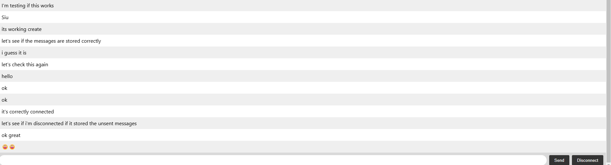

<a id="readme-top"></a>
<!-- PROJECT LOGO -->
<br />
<div align="center">
  <a href="https://github.com/Acrazie/SocketIoChat" target="_blank">
    
  </a>

  <h3 align="center">SocketIo Test Project</h3>

  <p align="center">
    This is a Socket Io Test project, to see on the stacks works
    <br />
    <a href="https://github.com/Acrazie/Portfolio"><strong>Explore the docs »</strong></a>
  </p>
</div>


<!-- TABLE OF CONTENTS -->
<details>
  <summary>Table of Contents</summary>
  <ol>
    <li>
      <a href="#about-the-project">About The Project</a>
      <ul>
        <li><a href="#built-with">Built With</a></li>
      </ul>
    </li>
    <li>
      <a href="#getting-started">Getting Started</a>
      <ul>
        <li><a href="#prerequisites">Prerequisites</a></li>
        <li><a href="#installation">Installation</a></li>
      </ul>
    </li>
    <li><a href="#contact">Contact</a></li>
  </ol>
</details>


<!-- ABOUT THE PROJECT -->
## About The Project

Avec ce projet, je voulais voir comment la stack SocketIo fonctionne, afin de réaliser un projet avec celle-ci sur une stack MERN.

Le fonctionnement est assez difficile à comprendre, il m'a fallu plusieurs jours d'expérimentation, de documentation...

J'espère que vous aimez ! 😀

<p align="right">(<a href="#readme-top">back to top</a>)</p>


### Built With

<br clear="both">

<div align="center">
  
  
  
  
  
  
  
  
  
</div>

###

<p align="right">(<a href="#readme-top">back to top</a>)</p>

<!-- GETTING STARTED -->
## Getting Started

Suivez le guide d'installation et tout ira bien :)

### Prerequisites

```sh
sudo npm cache clean -f
sudo npm install -g n
sudo n stable
```

### Installation

1. Clone the repo
   ```sh
   git@github.com:Acrazie/SocketIoChat.git
   ```
2. Install NPM packages
   ```sh
   npm install
   ```
3. Start the project
   ```sh
   node index.js
   ```

<p align="right">(<a href="#readme-top">back to top</a>)</p>

<!-- CONTACT -->
## Contact

<br clear="both">

<p align="center">
  <a href="https://www.linkedin.com/in/mayeuld/" target="_blank"></a>&nbsp;&nbsp;
  <a href="https://linktr.ee/MayeulDBZ" target="_blank"></a>&nbsp;&nbsp;
</p>

###

<p align="right">(<a href="#readme-top">back to top</a>)</p>
